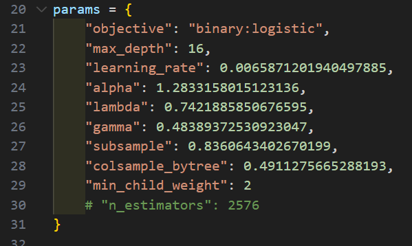
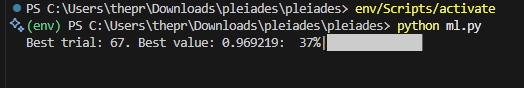

# Team Pleiades!!
The current model was trained with a GBT (Gradient Boosted Trees) ML algorithm. The training was done with `ml.py`, where a bayesian search was run to find the most optimal hyperparameters for our algorithm, in `testing/main.py`.

This ran over the course of 12 hours, and with our most effective and optimal set of parameters, we got an Area Under Curve of 0.970 and accuracy of 90.4% when testing against the provided `data.csv` file.

Above is an example of the bayesian search running.

Our locally hosted website can be ran with `flask run` in the terminal after installing all the dependencies, with 2 sections, being Home and Model. The home page provides the information regarding the challenge, and the model page provides a user-friendly interface to tweak the parameters themself and run the model, while providing external information regarding a potential extraterrestrial body.